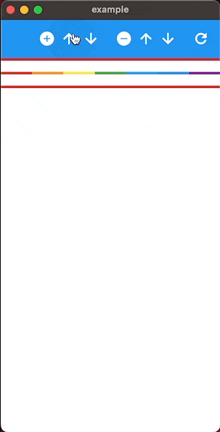

## two_way_scrollable

A set of two-way growable widgets for Flutter that properly fill the viewport.

## Example



## Features

- `TwoWayListView` - an `AnimatedListView` analog that properly grows in both directions.
- `TwoWayCustomScrollView` - a `CustomScrollView` analog that properly grows in both directions.

## Getting started

```shell
flutter pub add two_way_scrollable
```

## Usage

https://github.com/s0nerik/two_way_scrollable/blob/e8f3ac4c14d438535896cfee606cfcee7ee2d6da/example/lib/main.dart#L151
